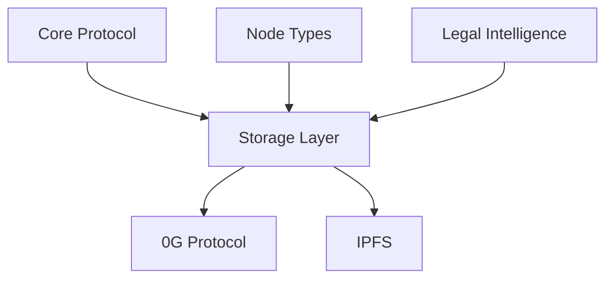
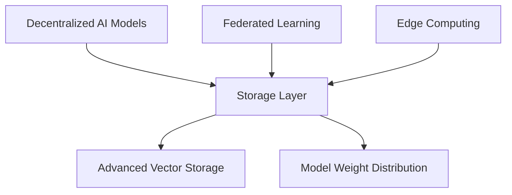

# DataHive Storage Layer

<p align="center">
  
</p>

## Strategic Position

DataHive-Storage-Layer serves as the foundational infrastructure layer designed to evolve with the growing demands of decentralized AI and legal intelligence operations. Similar to how Netflix positioned its infrastructure before streaming became mainstream, we're architecting for the future of decentralized AI capabilities.

### Protocol Architecture

#### Current Integration


#### Future Evolution


## Core Design Principles

### Evolutionary Architecture
- Modular storage interfaces
- Protocol-agnostic design
- Scalable data structures
- AI-ready storage patterns
- Dynamic capacity allocation

### AI-Ready Infrastructure
- Vector storage capabilities
- Model weight distribution
- Training data management
- Inference optimization
- Federated learning support

### Scalability Approach
- Horizontal scaling
- Sharding capabilities
- Cross-network distribution
- Dynamic node allocation
- Adaptive capacity

## Storage Components

### Base Layer
- Core data persistence
- Basic retrieval operations
- Redundancy management
- Protocol bridging
- Security enforcement

### AI Enhancement Layer
- Vector embeddings storage
- Model weight management
- Training data caching
- Inference optimization
- Performance analytics

### Evolution Path
```yaml
Phase 1 - Foundation:
  - Basic storage operations
  - Multi-protocol support
  - Redundancy management

Phase 2 - AI Ready:
  - Vector storage implementation
  - Model distribution support
  - Training data optimization

Phase 3 - Advanced AI:
  - Federated learning support
  - Edge computing optimization
  - Dynamic scaling capabilities
```

## Technical Implementation

### Current Architecture
```typescript
interface StorageProvider {
  // Basic operations
  store(data: Buffer): Promise<StorageReference>
  retrieve(reference: StorageReference): Promise<Buffer>
  
  // AI support
  storeVector(embedding: Float32Array): Promise<VectorReference>
  retrieveVector(reference: VectorReference): Promise<Float32Array>
  
  // Model operations
  storeModelWeights(weights: ModelWeights): Promise<ModelReference>
  retrieveModelWeights(reference: ModelReference): Promise<ModelWeights>
}
```

### Future Capabilities
```typescript
interface AIStorageProvider extends StorageProvider {
  // Federated learning
  distributedTraining(model: ModelConfig): Promise<TrainingResult>
  
  // Edge computing
  edgeDeployment(model: ModelConfig): Promise<DeploymentStatus>
  
  // Dynamic scaling
  scaleResources(requirements: ResourceConfig): Promise<ScalingResult>
}
```

## Integration Strategy

### Current Focus
- Basic storage operations
- Multi-protocol support
- Data redundancy
- Performance optimization

### Future Roadmap
- Vector storage implementation
- Model distribution networks
- Training data optimization
- Edge computing support
- Federated learning infrastructure

## Performance Considerations

### Current Metrics
```yaml
Targets:
  Throughput: >= 1000 ops/sec
  Latency: <= 100ms
  Redundancy: >= 3 protocols
```

### Future Requirements
```yaml
AI Operations:
  Vector Operations: >= 10000 ops/sec
  Model Distribution: <= 500ms latency
  Training Data Access: >= 5GB/s throughput
```

## Documentation

- [Architecture Evolution](./docs/architecture.md)
- [AI Integration Guide](./docs/ai-integration.md)
- [Scaling Strategy](./docs/scaling.md)
- [Future Roadmap](./docs/roadmap.md)
