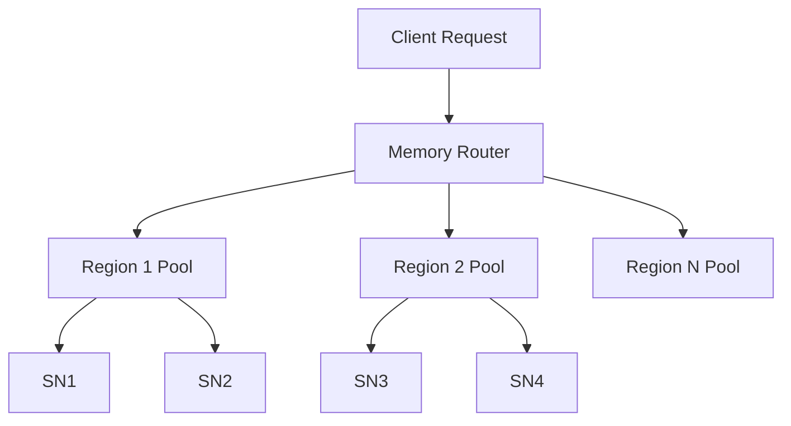

# Network RAM Architecture

## Overview

Network RAM is DataHive's revolutionary approach to distributed memory management, implementing a high-speed cache layer across Storage Nodes (SNs) that functions as virtual network-wide RAM. This system enables ultra-low latency data access while maintaining synchronization with primary storage layers.

## Core Concepts

### Network Memory Pool
```typescript
interface NetworkMemoryPool {
  // Memory management
  totalCapacity: number;
  allocatedMemory: number;
  availableMemory: number;
  
  // Distribution metrics
  nodeDistribution: Map<string, MemoryAllocation>;
  regionDistribution: Map<string, MemoryAllocation>;
}
```

### Memory Distribution


## Implementation

### Memory Management
```typescript
interface MemoryManager {
  // Core operations
  allocate(size: number): Promise<MemoryReference>;
  deallocate(reference: MemoryReference): Promise<void>;
  
  // Memory optimization
  defragment(): Promise<DefragmentationResult>;
  optimize(): Promise<OptimizationResult>;
  
  // Monitoring
  getUtilization(): Promise<UtilizationMetrics>;
  getPressure(): Promise<PressureMetrics>;
}
```

### Data Locality
```yaml
Locality Rules:
  - Geographic proximity
  - Access patterns
  - Data relationships
  - Usage frequency
  - Performance requirements
```

## Performance Optimization

### Memory Access Patterns
```typescript
interface AccessPattern {
  // Pattern analysis
  frequency: number;
  timeOfDay: Date;
  dataRelationships: Relationship[];
  
  // Optimization
  predictiveLoad: boolean;
  cacheStrategy: CacheStrategy;
}
```

### Predictive Loading
- Access pattern analysis
- Workload prediction
- Pre-emptive caching
- Resource reservation
- Load distribution

## Node Coordination

### Memory Synchronization
```typescript
interface SyncManager {
  // Sync operations
  syncRegion(region: string): Promise<SyncResult>;
  syncNode(nodeId: string): Promise<SyncResult>;
  
  // Consistency
  verifyConsistency(): Promise<ConsistencyResult>;
  resolveConflicts(): Promise<ConflictResolution>;
}
```

### Resource Allocation
```yaml
Allocation Strategy:
  Priority:
    - Critical operations
    - Model inference
    - Training data
    - General storage
  
  Distribution:
    - Load balancing
    - Geographic optimization
    - Performance requirements
    - Resource availability
```

## Integration Points

### Model Support
```typescript
interface ModelMemoryManager {
  // Model operations
  loadModel(modelId: string): Promise<ModelReference>;
  unloadModel(reference: ModelReference): Promise<void>;
  
  // Resource management
  reserveMemory(requirements: ModelRequirements): Promise<Reservation>;
  releaseReservation(reservation: Reservation): Promise<void>;
}
```

### Data Pipeline Integration
- Stream processing
- Batch operations
- Real-time analytics
- Cache warming
- Memory prefetching

## Monitoring

### Performance Metrics
```yaml
Key Indicators:
  Access Latency: <= 100μs
  Hit Rate: >= 95%
  Memory Utilization: <= 85%
  Network Overhead: <= 5%
```

### Health Monitoring
- Memory pressure
- Access patterns
- Error rates
- Network health
- Node status

## Related Documentation

- [Storage Node Network](./storage-node-network.md)
- [Performance Optimization](./performance-optimization.md)
- [Integration Guide](./integration-guide.md)
- [Monitoring Setup](./monitoring-setup.md)
